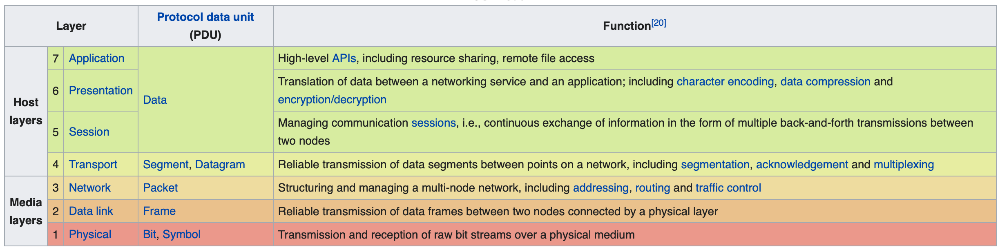
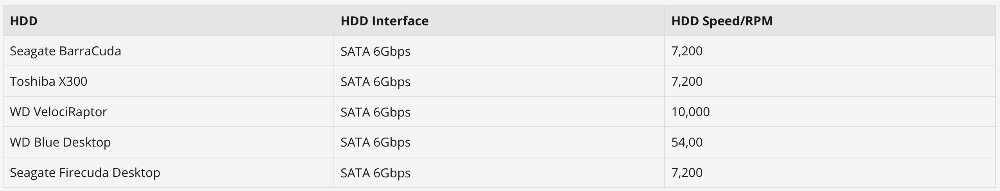
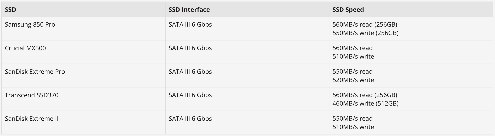
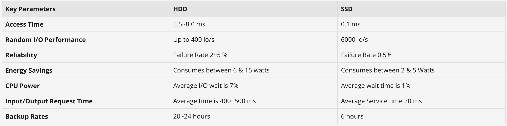

# Systems Design
A fundamental part of any technical interview. It is abstract in nature, and requires knowledge and experience to get through successfully. 
Designing large scale systems is not an easy job. But, it is what most of the Engineers that work at big tech companies do on their daily basis: solving problems at scale, a scale probably never explored before. To this point, during the interview the ability to disambiguate, think through a complex scenario and come up with a logical solution are evaluated.
In the remainder of this section, pointers for refreshers of the fundamentals are provided. Subsequentely, a worflow is defined: it should help with the practice, and hopefully the day of the interview.

## Fundamentals
In order to be successfull, a number of fundamentals should be really solid: a candidate should be comfortable talking about that, and applying those to a complex scenario.
To be remembered: everything is a trade-off. In particular:

- Performance Vs Scalability - check whether the system is slow for a single user, or whether it is slow under load; in the latter case, there is a scalability issue. 
- Latency Vs Throughput - aim for maximum throughput for acceptable latency.
- Availability Vs Consistency - referring to the CAP theorem, reaching consistency, availability and partition tolerance is impossible, a trade-off needs to be struck: Availability and Partitioning (AP, continue serving the latest available version in case of network partitioning), and Consistency and Paritioning (CP, continue serving the latest version consistency in case of network partitioning).

In particular, there are primarily three levels of consistency:

- Weak Consistency - replicas may not see the update, due to a network partitioning; result of a best-effort replication (e.g. VoIP or any other chat system which does not guarantee store-and-forward).
- Eventual Consistency - replicas will eventually see the update and serve it, most of the time this happens withing milliseconds; result of an asynchronous replication (e.g. queue-based replication). 
- Strong Consistency - replicas sees the update online; result of a synchronous replication (e.g. RDBMs replication strategies).

### Distributed Systems Building Blocks
### Basics of a Distributed System

- CAP Theorem - a well-knnown results from the theory of distributed systems: consistency, availability and partition tolerance cannot be reached in a distributed systems supported by asynchronous networking (i.e. loose guarantee of delivery within given time bounds), and 2 out of 3 properties should be picked. In particular, CP and AP are the famous combinations that are often used, considering that it is not possible to not account for partitioning in distributed systems and partition tolerance is fundamental. In the former case, CP, consistency and parition tolerance are guaranteed, meaning that in case of network parititioning the system will continue to operate guaranteeing immediate data consistency; in the latter case, AP, availability and partition tolerance are guaranteed, meaning that the in case of network partitioning the system will continue to operate without guaranteeing immediate data consistency (i.e. cases of weak consistency, eventual consistency, and so on).
- SQL Vs NoSQL - those database technologies that follow the relational model Vs those that do not. The relational model was designed early in the eighties and accommodate the scale up paradigm: i.e. scale the system adding more resources. Clearly, such a design results inadeguate for cases when the system needs to be scaled out, or better the system scales as the number of machines composing it does. From this remark, and following the results of the CAP Theorem, in the early years of the new century, the non-relational paradigm is emerged as predominant for those use cases that require horizontal scalability; on top of that, the model has been re-adapted to serve specfic purposes and new database technologies have emerged: K/V stores, Graph databases, Column databases, mix of K/V and Column database, multi-model database, and so on. Most of those database technologies are provided with an out-of-the-box support for large-scale replication and different operation modes, with the vast majority providing eventual consistency guarantees (i.e. consistency is not immediate but it happens within certain time bounds).

Key concepts:

- [Load Balancer](https://github.com/donnemartin/system-design-primer#load-balancer)
- [Cache](https://github.com/donnemartin/system-design-primer#cache)
- [Redundancy and Replication](https://github.com/donnemartin/system-design-primer#replication)
- [Data Partitioning (aka Sharding)](https://github.com/donnemartin/system-design-primer#sharding)
- [Federationg (aka Functioal Partitioning)](https://github.com/donnemartin/system-design-primer#sharding)
- [Proxy](https://github.com/donnemartin/system-design-primer#reverse-proxy-web-server)
- [Consistent Hashing](https://www.paperplanes.de/2011/12/9/the-magic-of-consistent-hashing.html)

### About Networking

ISO/OSI stack organizes the network stack in 7 layers:

- Application Layer (L7)
- Presentation Layer (L6)
- Session Layer (L5)
- Transport Layer (L4)
- Network Layer (L3)
- Data Link Layer (L2)
- Physical Layer (L1)

### About Systems

Important aspects of any system are the design of in-memory and disk-baked data structures. In order to operate, a system should bring the data to the CPU through the memory hierarchy. The in-memory design of data structures allow to define the key aspects for state access and modification. On the other hand, when data structures become too big to being stored in memory (a typical case is a database), they are offload or serialized to disk. The OS system abstract the basic unit of file which defines the persistent storage basics to then persist the state and provide access to it.

To recap, looking at systems, it is important to make sure that in-memory and physical design of data structure are clearly defined according to the contextual requirements. 

- In-memory design. Get deeper into how data structures can be modeled in memory.
- Physical design. Get deeper into how data structures can be modeled on the storage.

### Storage Technologies

Storage technologies are typically differentiated in [spinning and solid-state disks or HDD Vs SSD](https://www.google.com/url?sa=t&rct=j&q=&esrc=s&source=web&cd=&ved=2ahUKEwj7nI-Jz-TvAhUMx4UKHXXaAkMQFjAAegQIAhAD&url=https%3A%2F%2Fwww.pcmag.com%2Fnews%2Fssd-vs-hdd-whats-the-difference&usg=AOvVaw1oVuAQstp0aMp8zHhNvwg-). In paritcular, in terms of [speed and fundamental use cases (i.e. hot Vs cold storage)](https://www.intel.com/content/www/us/en/products/docs/memory-storage/solid-state-drives/ssd-vs-hdd.html):

> What makes SSDs an increasingly popular choice is their speed. Across the board, SSDs outpace HDDs because they use electrical circuitry and have no physical moving parts. This leads to shorter wait times when you’re starting up and fewer delays when opening apps or doing heavy computing tasks. 

> A typical SSD from Intel with a middle-of-the-road 512 GB capacity offers up to 10x faster read speeds and up to 20x faster write speeds than a midrange HDD, which only offers data transfer speeds of up to 140 MB/s.

> Although no one ever complains that their computer is too fast, there are times when an HDD can make sense. If you have terabytes of files that you want to store, HDDs are still a less expensive option, although that’s changing with increasingly lower SSD prices. Computer storage decisions can be simplified by thinking of data as either cold or hot. "Cold" data might include the years of photos you want to keep on your laptop but don’t look at every day and don’t need quick access to. HDDs can be an excellent, cost-effective choice for cold data. At the other end of the spectrum, if you’re a business running real-time transactions, editing videos and photos and need fast access to database files, video clips, or models, or even just running the operating system, that’s what we refer to as "hot" data. The fast performance of SSDs makes them an ideal choice for those efforts where speedy access to your data is what matters most.

There is a relevant difference between the two technologies, and their costs. Hereafter comparisons for the speed and intrinsic characteristics.

Differences between SSD and HDD:

### About Operating Systems
An Operating System abstracts hardware resources for a final user and provides a set of API to access, in a disciplined and secure way, such resources. When it come to resources, there are primarily three resources to account for: CPU time, RAM and Disk space. 
In the remainder of this section, a few refreshers will be provided for three important aspects of an Operating System: process, memory and storage management, or namely scheduling, memory usage and file system handling.

A very [short recap](https://medium.com/@abang.nurbarkah/process-memory-and-storage-management-28f9e9810740) about the role of an Operating System when it comes to manage processes and related resources.

#### System Calls

It is important to understand the role of [system calls](https://en.wikipedia.org/wiki/System_call) when it comes to operating system routines like managing processes, memory, storage and devices.

> A [system call](https://www.guru99.com/system-call-operating-system.html) is a mechanism that provides the interface between a process and the operating system. It is a programmatic method in which a computer program requests a service from the kernel of the OS.

The [list of system calls](https://man7.org/linux/man-pages/man2/syscalls.2.html): syscalls.

#### Process Management

> [Process](https://www.guru99.com/process-management-pcb.html) is the execution of a program that performs the actions specified in that program. It can be defined as an execution unit where a program runs. The OS helps you to create, schedule, and terminates the processes which is used by CPU. A process created by the main process is called a child process.

> [Process management](https://www.guru99.com/os-memory-management.html) involves various tasks like creation, scheduling, termination of processes, and a dead lock. Process is a program that is under execution, which is an important part of modern-day operating systems. The OS must allocate resources that enable processes to share and exchange information. It also protects the resources of each process from other methods and allows synchronization among processes.

#### Memory Management

> [Memory Management](https://www.guru99.com/file-systems-operating-system.html) is the process of controlling and coordinating computer memory, assigning portions known as blocks to various running programs to optimize the overall performance of the system.

#### Storage Management

Also intended as File System management.

> A file is a collection of correlated information which is recorded on secondary or non-volatile storage like magnetic disks, optical disks, and tapes. It is a method of data collection that is used as a medium for giving input and receiving output from that program.

### About Databases
Database technologies may be classified in three major types. 

- SQL - traditional relation databases which leverage the SQL as query language. The databases adopt a row model, or better row format for the storage. Queries are serverd through the SQL interface which is able to provide a domain specific language for the querying layer. Such technologies favor CP over AP, so consistency also in large-scale deployments.
- NoSQL - traditionally identified as non-relational databases. K/V storage, Graphs, Colum-based databases, and so on are example of NoSQL technologies. Often, referred to non-SQL because the query languages are specialized, even if in many cases they resemble a lot the traditional SQL. Non-relational databases are designed for scale, and most of them to be eventual consistent (favor AP over CP, refer to the CAP theorem).
- NewSQL - a brand new paradigm which tries to take the best of the two worlds (SQL and No-SQL) into a type of databse technology which is able to run at a scale without trading off consistency: a kind of trade off of AP and CP, depending on the context, which surpasses the limitations imposed by the CAP theorem (refer to CAP theorem revisited, adding software-driven intelligence to topology management to handle the limitations of CAP).

### About Front End and Back End
Typical distinction to separate what is implementing the business logic and what is, instead, implementing the presentation. 
Large scale systems are organized in layers, for the sake of their modularity but also of their scalability. The distinction between front-end and back-end goes exactly in that direction. 

- Front-end - typically a presentation or data serving layer; it abstracts API and web resources that can be directly leveraged from the end users to get access to the business functionliaties.
- Back-end - typically a business logic layer; it abstracts all services that, together, provide the final platform services.

Concrete example. In a 3-tier architecture, the front-end is defined by the web and API layers, instead the back-end is defined by the service and storage layers. 

## Workflow
To tackle the problem at hand, it is required to be disciplined in following a structured reasoning process to maximize the chane of being successful.

### Disambiguate/Requirements Clarifications
Ask questions to make sure that the context is fully understood, in particular:

- what are the use cases?
- what are the typical user?
- what is the deployment model to be expected? I.e. is it multi-geography?
- what is the level of consistency desired?

### Sizing/Back-of-the-envelope Estimation
Ask questions to clarify the size of the system in terms of operations to be sustained per second, in particular:

- how many concurrent access should we consider?
- how many concurrent writes should we consider?
- how large should we assume a record to be?
- what is a tolerable end-to-end latency?
- what kind of hardware should we consider? I.e. in terms of spec.

### Basic Building Blocks
- System interface definition
- Defining data model
- High-level design
- Detailed design

### Control and Data Flows

- Data Flow - depicts the data flow between components, intended as sources and destinations.
- Control Flow - depicts the steps/operations/activities withing the workflow and their relative order.

Depending the level of details, describe the data and/or control flows.

It is important to describe the data flowing in the system, in particular for complex distributed systems. Sometime, according to how the interview proceeds and the need from the interviewer in terms of details, it is also required to describe the flow of operations and their relative order.

### Identify Failure Domains and Bottlenecks

Proceeding with the interview, it is worth giving a try at identifying the failure domain and any bottleck. 

To identify a failure domain, it is first required to define which are the fault/failure types to consider, it is then necessary to classify component by component the impact of such component being affected. On the same model, identifying the bottlenecks means looking at those components that are not scaled up and that might become a problem under load either back pressuring or literally failing. 

For instance, let's consider a large distributed system which provides access to its services via REST APIs. Such system is composed by a reverse proxy, a web tier and a backend tier. There is a single instance of reverse proxy, 3 instances of web servers and 2 instance of backend database replicating in active/passive mode. Under load, the proxy can be certainly identifiable as a bottleneck: all inbound traffic converges there. Being an active/passive replication scheme and considering that the active replica normally takes writes and the passive replica takes reads, for heavy write and read load the replicated database can be identified as a bottleneck as well. Looking at the failure domains, in case of fault/failure of the proxy, the system results to be unavailable so it is a common mode failure; likewise, in case of a fault/failure of the write- or read-only database replicas, respectively for transactions or for queries.

A quick note about common mode failure. In Engineering a common mode failure is determined by the events which are not statistically independent which brings the system to fail as a whole. For instance, an electronic system wherein a fault in a power supply injects noise onto a supply line, causing failures into multiple subsystems.

In the example above, the failure of the reverse proxy managing the inbound traffic can be perceived, from an user perspective, as a general failure or as a common mode failure considering that the user does not kwnow the details of the system but it does see that the service is impacted to the point that it cannot serve as its normal routine. 

### Address Criticalities

Being diligent in noting criticalities makes easier to address those at the end of the process. In fact, it is important to come up with a design for the system which reflects the requirements and the expectations, realizing that there is no perfect design and that all systems have criticalities. 

A criticality may be intended as a factor to be accounted. For instance, let's imagine a large distributed system which is spanning geographies, in such scenario a criticality might be a stable dark fiber connectivity or a special deal with the ISP to make sure that synchronous replication, if any, is not impacted by BGP fluctuations or events like this.

The example above described represents a criticality, and once discussed with the interviewer, either it can be addressed or an assumption can be made to continue the work on the problem at hand.

# References

- [The System Design Primer](https://github.com/donnemartin/system-design-primer)
